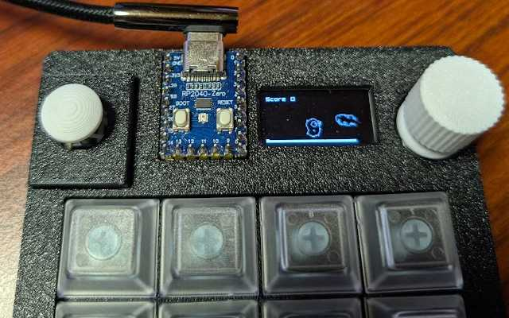

# koebiten

**The API is not yet fixed.**

Koebiten is a package for making simple games.
Koebiten was heavily influenced by a package called Miniten when development began.
Since then, additional features have been inspired by Miniten's foundation, Ebitengine.

* https://ebitengine.org/
* https://github.com/eihigh/miniten

## games/flappygopher


For now, koebiten only works on [zero-kb02](https://github.com/sago35/keyboards) and [macropad-rp2040](https://learn.adafruit.com/adafruit-macropad-rp2040). It needs some improvements to run in a more general environment.  

```
$ tinygo flash --target ./targets/zero-kb02.json --size short ./games/flappygopher
$ tinygo flash --target gopher-badge --size short ./games/flappygopher
```

## games/jumpingopher



```
$ tinygo flash --target ./targets/zero-kb02.json --size short ./games/jumpingopher
$ tinygo flash --target gopher-badge --size short ./games/jumpingopher
```

more info : [./games/jumpingopher](./games/jumpingopher)

## Others

The other games are located under [./games](./games).

Refer to the [Makefile](./Makefile) for instructions on how to build.

# hardware

The currently supported hardware is as follows.

* zero-kb02 (--target ./targets/zero-kb02.json)
    * https://github.com/sago35/keyboards
* gopher-badge
    * https://gopherbadge.com/
* pybadge / gobadge
    * https://learn.adafruit.com/adafruit-pybadge
* wioterminal
    * https://www.seeedstudio.com/Wio-Terminal-p-4509.html
* macropad-rp2040
    * https://learn.adafruit.com/adafruit-macropad-rp2040
* gopher-board
  * https://github.com/sat0ken/gopher-board/tree/main/rp2040/v2

## Add new hardware

When adding new hardware, please refer to [#7](https://github.com/sago35/koebiten/pull/7).
If the hardware you're adding is not a simple, off-the-shelf product like zero-kb02,
you'll need a build tag such as `go:build zero_kb02`.
For more details, see [#8](https://github.com/sago35/koebiten/pull/8).

## link

* https://ebitengine.org/
* https://github.com/eihigh/miniten
* https://github.com/sago35/keyboards
