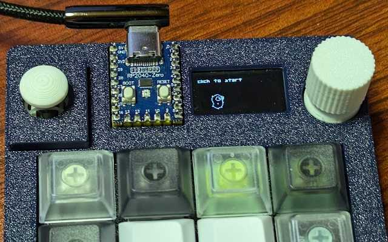
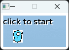

# miniten-examples

koebiten is a miniten clone that runs on TinyGo.

* https://github.com/eihigh/miniten

## games/flappygopher

### run with koebiten



When running with TinyGo, please enable the following in go.mod and build.  
For now, koebiten only works on zero-kb02. It needs some improvements to run in a more general environment.  

```
replace github.com/eihigh/miniten => .
```

```
$ tinygo flash --target waveshare-rp2040-zero --size short ./games/flappygopher
```

### run with miniten



The same source code mentioned above can be run on miniten and on a computer.  

```
$ go run ./games/flappygopher
```

